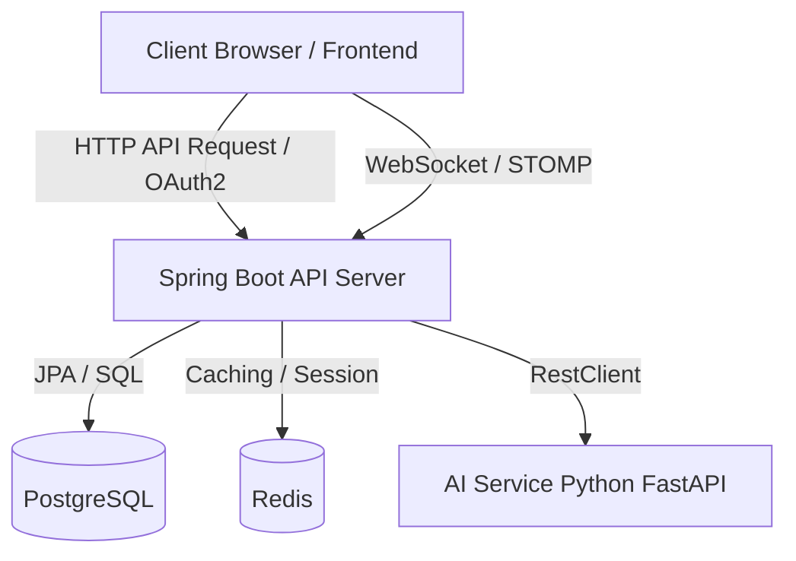

# FolioFrame Backend
포트폴리오 작성부터 AI 첨삭, 채용 지원 및 제안까지 연결하는 커리어 플랫폼

[](https://openjdk.org/)
[](https://spring.io/projects/spring-boot)
[](https://www.postgresql.org/)
[](https://redis.io/)
[](https://www.docker.com/)
[](https://github.com/features/actions)

📌 Project Overview
**FolioFrame(폴리오프레임)**은 포트폴리오 작성이 막막한 구직자가 쉽게 시작할 수 있도록 돕는 **템플릿 제공**부터, 완성도를 끌어올리는 **AI 첨삭 피드백**, 그리고 완성된 포트폴리오를 바탕으로 기업 공고에 직접 지원하거나 기업으로부터 제안을 받는 **채용 연결**까지의 전 과정을 지원하는 커리어 플랫폼입니다.

포트폴리오의 뼈대를 잡고 수준을 한 단계 높이는 고도화 작업부터, 기업 공고 탐색 및 지원·제안 수락, 그리고 간단한 사전 문의나 채용 안내를 위한 실시간 채팅까지 — 구직자와 기업 모두의 채용 여정을 유기적으로 연결합니다.

🎯 서비스 핵심 흐름 (Core Flow)
- **Step 1. 포트폴리오 작성 시작 (템플릿 선택)**: 포트폴리오 구성을 어려워하는 구직자들을 위해 관리자가 제공하는 다양한 템플릿을 선택할 수 있습니다. 각 템플릿마다 사전에 구성된 고유한 커스텀 필드가 포함되어 있어 별도 설정 없이 바로 포트폴리오 작성을 시작할 수 있습니다.
- **Step 2. 포트폴리오 수준 극대화 (AI 첨삭)**: 작성된 콘텐츠를 분석하여 개인의 핵심 역량과 성과를 바탕으로 포트폴리오의 완성도와 깊이를 한 단계 끌어올리는 실시간 AI 첨삭 피드백, 점수 측정 및 버전 관리를 지원합니다.
- **Step 3. 채용 연결 (지원·제안) & 실시간 소통**: 인재는 필터링 검색을 통해 원하는 기업 공고에 직접 지원하고, 기업은 인재 포트폴리오를 탐색하여 제안을 보낼 수 있습니다. 지원·제안 전후로 간단한 문의나 안내가 필요할 때 STOMP 기반 실시간 1:1 채팅을 통해 소통합니다.

⚡ Key Features
1. 📁 **포트폴리오 및 템플릿 시스템**
   - 관리자가 제공하는 템플릿 목록에서 선택하여 포트폴리오 생성
   - 템플릿마다 고유하게 구성된 필드를 기반으로 내용 작성
   - 공개/비공개 설정을 통해 포트폴리오 관리 가능

2. 🤖 **AI 피드백 및 포트폴리오 버전 관리**
   - AI 워커와 동적 동기화 API 연동 (RestClient 사용)
   - AI 첨삭 후 원본 스냅샷 자동 생성 및 다중 버전 관리 가능
   - AI 첨삭 피드백 채택/직접 수정/저장/게시 유연한 워크플로우

3. 💬 **실시간 채팅 (WebSocket & STOMP)**
   - `/ws` 엔드포인트를 통한 연결 및 JWT 기반 Stomp 토큰 인증 처리
   - 기업 담당자와 인재 간의 1:1 대화방 개설 및 메시지 브로드캐스팅 (`/topic/chat-rooms/{roomId}`)
   - 메시지 전송 시 JWT Principal 추출을 통한 보안 검증

4. 🔐 **인증 및 인가**
   - Spring Security + JWT(Json Web Token) 기반 자체 로그인/회원가입
   - Google Social OAuth2 연동 로그인 기능 제공
   - 블랙리스트 및 Redis 연동 기반 로그아웃 세션 만료 관리

5. 💼 **채용 공고 & 대외활동 관리**
   - 카테고리/지역/팀 규모/정렬 방식을 지원하는 대외활동 조회 및 북마크
   - 기업 회원의 채용 공고 등록 및 구직자 지원 파이프라인
   - 학력/경력/자격증을 통합 관리하는 인재 프로필 연동

🛠️ Tech Stack
### Backend
| 기술 | 버전 | 용도 |
| :--- | :--- | :--- |
| **Java** | 21 | 메인 언어 |
| **Spring Boot** | 4.0.6 | API 서버 프레임워크 |
| **Spring Security** | 6.x | 인증 / 인가 필터 구성 |
| **Spring Data JPA** | - | ORM 데이터 액세스 |
| **Hibernate** | 6.x | JPA 구현체 |
| **QueryDSL** | 5.0.0 | 동적 쿼리 및 Q-Class 생성 |
| **JJWT (io.jsonwebtoken)** | 0.12.6 | JWT 토큰 생성 및 파싱 |

### Database & Cache
| 기술 | 용도 |
| :--- | :--- |
| **PostgreSQL** | 메인 RDBMS |
| **Redis** | 토큰 관리, 로그아웃 세션 만료, WebSocket 세션 핸들링 |

### Infrastructure & Tools
| 기술 | 용도 |
| :--- | :--- |
| **Docker** | 애플리케이션 컨테이너화 |
| **GitHub Actions** | CI/CD 파이프라인 (Docker Hub 빌드 후 AWS EC2 자동 배포) |
| **Swagger (SpringDoc)** | `springdoc-openapi-starter-webmvc-ui:3.0.2`를 이용한 API 문서화 |
| **Lombok** | 보일러플레이트 코드 제거 |
| **JUnit 5** | 테스트 러너 |

🏗️ System Architecture


🚀 Getting Started
### Prerequisites
- JDK 21 (Eclipse Temurin 권장)
- Gradle 8.14.5+ (Wrapper 포함)
- Docker (배포 및 컨테이너 환경 실행 시 필요)
- PostgreSQL & Redis 인스턴스

### Environment Variables
프로젝트 루트 경로에 `.env` 파일을 생성하고 아래 환경 변수들을 설정합니다:

```properties
# ===== Database (Dev / Local) =====
POSTGRES_PORT=5433
POSTGRES_DATABASE=folioframe
POSTGRES_USER=your_postgres_user
POSTGRES_PASSWORD=your_postgres_password

# ===== Database (Production Profile) =====
DB_URL=jdbc:postgresql://your-prod-db-host:5432/folioframe
DB_USERNAME=your_prod_user
DB_PASSWORD=your_prod_password

# ===== Redis =====
REDIS_HOST=localhost
REDIS_PORT=6379
REDIS_PASSWORD=your_redis_password

# ===== Server Options =====
SERVER_PORT=8080
SPRING_PROFILES_ACTIVE=dev

# ===== JWT Security =====
JWT_SECRET=your_jwt_secret_key_at_least_32_characters_long_for_security
JWT_ACCESS_EXPIRATION=3600000
JWT_REFRESH_EXPIRATION=604800000

# ===== Google OAuth2 =====
GOOGLE_CLIENT_ID=your_google_client_id
GOOGLE_CLIENT_SECRET=your_google_client_secret

# ===== AI Service =====
AI_SERVICE_BASE_URL=http://localhost:8000
AI_SERVICE_API_KEY=your_ai_service_api_key
```

### Installation & Run
```bash
# 1. 저장소 클론 및 이동
git clone <repository-url>
cd BE

# 2. 빌드 (테스트 실행 제외)
./gradlew clean build -x test

# 3. 애플리케이션 실행
./gradlew bootRun
```

📖 API Documentation
Swagger UI를 통해 REST API 명세를 실시간으로 확인할 수 있습니다.

- **Local Swagger UI**: `http://localhost:8080/swagger-ui/index.html`
- **Swagger JSON API**: `http://localhost:8080/v3/api-docs`

📂 Directory Structure
`src/main/java/com/folioframe/`
```
├── 🌐 domain/                          # 도메인 계층 (비즈니스 로직)
│   ├── activity/                       # 대외활동 정보 조회 및 북마크
│   ├── chat/                           # 실시간 STOMP 1:1 채팅방 및 메시지 전송
│   ├── common/                         # 공통 기초 데이터 (기술스택, 지역, 직군)
│   ├── company/                        # 기업 회원 프로필 관리
│   ├── job/                            # 채용 공고 등록 및 인재 지원 프로세스
│   ├── matching/                       # 기업 ↔ 인재 간 매칭 제안 및 수락/거절 관리
│   ├── member/                         # 일반 회원 정보, 알림 수신, OAuth/일반 가입 처리
│   ├── portfolio/                      # 포트폴리오 CRUD, 필드, 프로젝트, 템플릿 연동
│   │   └── ai/                         # 포트폴리오 피드백 요청, 버전 및 수정본 관리
│   ├── talent/                         # 인재 정보 등록 (학력, 경력, 자격증 등)
│   └── token/                          # JWT 토큰 갱신 서비스
│
├── ⚙️ global/                          # 전역 설정 및 인프라 계층
│   ├── apiPayload/                     # 공통 응답 포맷 (ApiResponse), 에러 핸들러
│   ├── auth/                           # Security 인증 필터, JWT 유틸, OAuth2/Stomp 핸들러
│   ├── config/                         # QueryDSL, RestClient, Security, Web, WebSocket 설정
│   ├── dto/                            # 페이징 Request/Response 공통 객체
│   ├── entity/                         # Auditing 용 BaseEntity
│   └── util/                           # 공통 유틸리티 클래스
│
└── FolioframeApplication.java          # 애플리케이션 시작 파일
```

🌿 Git Branch Strategy
기본적으로 **Git Flow** 모델의 단순화 버전을 활용합니다.

- **`main`**: 상용(Production) 배포용 브랜치
- **`dev`**: 개발 통합 및 기본 작업 브랜치
- 작업 단위 브랜치 (`feat/*`, `fix/*`, `refactor/*` 등)는 `dev` 브랜치에서 분기하여 작업하며, 작업 완료 후 Pull Request(PR) 및 코드 리뷰를 거쳐 `dev`로 병합됩니다.

---

<p align="center">
  FolioFrame BE · Built with ☕ by FolioFrame Team
</p>
